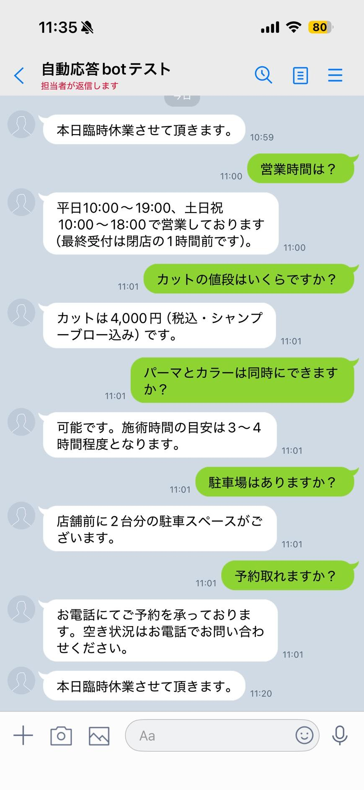
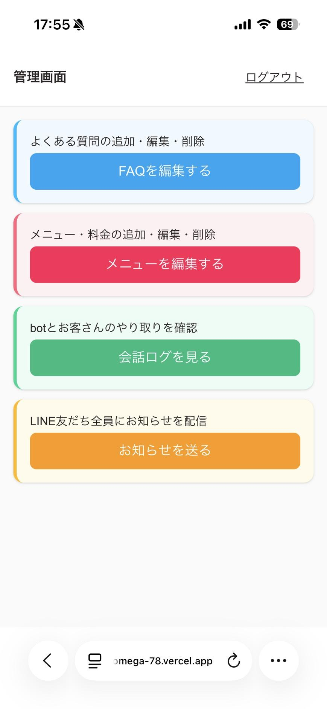
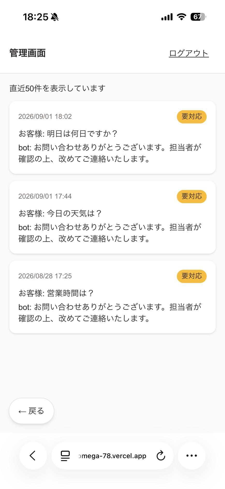
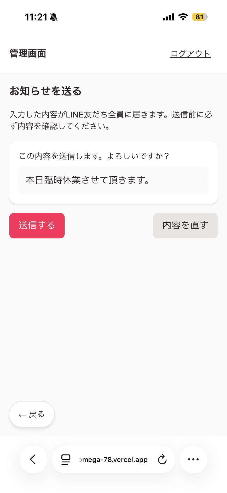

# 美容室LINE自動応答bot（模擬案件）

美容室オーナー様を想定した架空のクライアント案件です。ヒアリング → 提案書作成 → 実装 という、実際のクライアントワークの一連の流れを一人で練習するために作成したポートフォリオ用プロジェクトです。

## この案件について

お客様からLINEで届く「営業時間は？」「メニューと料金は？」といったよくある質問に自動で答え、botで答えられない質問だけをオーナー様のLINEに転送する仕組みを作りました。あわせて、オーナー様がスマホから直接FAQやメニューを更新できる管理画面も実装しています。

- ヒアリング内容: [`hearing.md`](./hearing.md)
- 提案書: [`proposal.md`](./proposal.md)
- ヒアリング〜提案の想定Q&A: [`sample_hearing_qa.md`](./sample_hearing_qa.md)
- 作業計画（WBS）: [`wbs.md`](./wbs.md)
- 開発の進捗ログ: [`progress.md`](./progress.md)

> 提案書では低コスト運用を優先しPython(FastAPI) + Google Cloud Runという構成を提案していますが、実装（本リポジトリの`webapp/`）はポートフォリオとして普段使い慣れているNext.js + Supabaseスタックで構築しています。機能要件は提案書に準拠しつつ、技術選定はあえて変えている点が特徴です。

## できること

- **LINEでのFAQ自動応答**: お客様の質問文をAI（OpenAI API）が解析し、登録済みのFAQ・メニュー情報をもとに自動回答
- **未対応質問のエスカレーション**: AIが自信を持って答えられない質問は、定型の保留メッセージをお客様に返しつつ、オーナー様個人のLINEに質問内容を転送
- **お知らせ一斉配信**: LINE友だち全員に、管理画面からお知らせメッセージを一斉送信
- **管理画面（スマホ対応）**:
  - FAQの追加・編集・削除
  - メニュー・料金の追加・編集・削除
  - お客様とbotのやり取りログの閲覧（未対応質問には目印を表示）
  - お知らせの一斉配信（誤送信防止の確認ステップつき）
  - 共通パスワードによる簡易ログイン

## 使用技術

| カテゴリ       | 技術                                       |
| -------------- | ------------------------------------------ |
| フレームワーク | Next.js 16（App Router）+ TypeScript       |
| スタイリング   | Tailwind CSS v4                            |
| データベース   | Supabase（PostgreSQL、Row Level Security） |
| メッセージ連携 | LINE Messaging API                         |
| AI回答生成     | OpenAI API（gpt-4o-mini）                  |
| ホスティング   | Vercel                                     |

## スクリーンショット









## 公開URL

- 管理画面: https://webapp-six-omega-78.vercel.app/admin
  - （動作確認用の共通パスワードでログインする方式のため、閲覧をご希望の場合はお問い合わせください）

## ドキュメント

開発の詳細は `webapp/docs/` 配下に整理しています。

- [セットアップ手順書](./webapp/docs/setup-guide.md) — 開発環境をゼロから構築する手順（引き継ぎ用）
- [運用マニュアル（オーナー向け）](./webapp/docs/owner-manual.md) — FAQ・メニューの更新、お知らせ配信などの日常操作
- [技術ドキュメント](./webapp/docs/technical-doc.md) — API仕様・DB設計・外部サービス連携図

## ディレクトリ構成

```
.
├─ hearing.md              … ヒアリング内容
├─ proposal.md             … 提案書
├─ sample_hearing_qa.md    … ヒアリング〜提案の想定Q&A
├─ wbs.md                  … 作業計画
├─ progress.md             … 開発の進捗ログ
└─ webapp/                 … 実装本体（Next.js）
   ├─ src/
   │  ├─ app/api/line-webhook/  … LINE Webhookエンドポイント
   │  ├─ app/admin/             … 管理画面
   │  └─ lib/                   … DB接続・AI回答生成などの共通処理
   ├─ supabase/migrations/      … データベース定義
   └─ docs/                     … 引き継ぎ用ドキュメント
```
