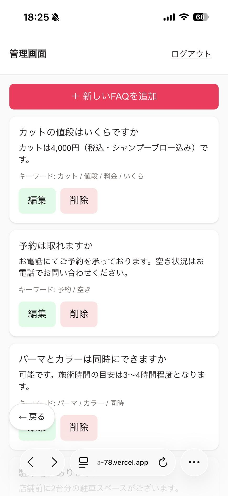
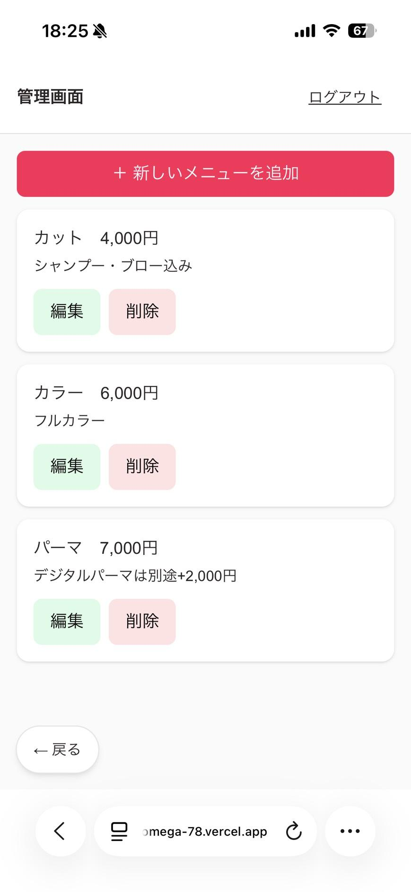
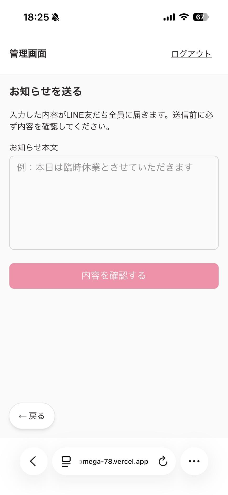

# 運用マニュアル（オーナー様向け）

このマニュアルは、日々の運用（よくある質問の追加、メニューの更新、お知らせの配信など）を行う方向けの説明書です。スマホから読める形でまとめています。専門的な言葉はできるだけ使っていません。

## このマニュアルの開き方

このページ自体は、スマホのブラウザ（SafariやChromeなど）で以下のURLを開くと、いつでも見られます。ログインやパスワードは不要です。

```
https://github.com/minamikato54-max/linebot-ai-salon-mock/blob/main/webapp/docs/owner-manual.md
```

**よく見る場合は、ホーム画面に追加しておくと次回から探さずに開けて便利です**（Safariの場合: 共有ボタン →「ホーム画面に追加」／Chromeの場合: メニュー →「ホーム画面に追加」）。

> 📷 **スクリーンショットを挿入する場所**: スマホのブラウザでこのURLを開いた直後の画面（マニュアルのタイトルが表示されている状態）

---

## 1. 管理画面の開き方

1. スマホのブラウザ（SafariやChromeなど）で、以下のURLを開く
   ```
   https://webapp-six-omega-78.vercel.app/admin
   ```
2. パスワードを聞かれるので入力する（パスワードは別途お伝えしたものをご使用ください）
3. 下のような画面が開けばログイン成功です

> 📷 **スクリーンショットを挿入する場所**: 管理画面のホーム画面（FAQ/メニュー/会話ログ/お知らせ配信の4つのボタンが並ぶ画面）

**よく使う場合は、ホーム画面に追加しておくと便利です**（Safariの場合: 共有ボタン →「ホーム画面に追加」）。

管理画面の中を移動しているときは、画面の左下に「← 戻る」ボタンが常に表示されています。迷ったらこのボタンを押せば、ホーム画面に戻れます。

---

## 2. よくある質問（FAQ）の追加・編集・削除

お客様からLINEで届く質問に、botが自動で答えるための元データです。

### 追加のしかた

1. ホーム画面から「**FAQを編集する**」を押す
2. 一覧の一番上にある「**＋ 新しいFAQを追加**」ボタンを押す
3. 「質問」「回答」「キーワード」を入力する
   - **キーワード**は、お客様の質問文にこの言葉が含まれていたら反応しやすくなる、という目印です。例えば「営業時間」というFAQなら、キーワードに「営業時間」「何時」などを入れておくと拾われやすくなります
4. 保存ボタンを押す

### 編集・削除のしかた

一覧画面で、それぞれのFAQの下に緑色の「**編集**」ボタンと、赤色の「**削除**」ボタンがあります。

- 編集: 内容を直したいときに押す
- 削除: 押すと確認の表示が出るので、本当に消してよければもう一度押す（誤操作防止のため2段階になっています）

> 📷 **スクリーンショットを挿入する場所**: 「＋ 新しいFAQを追加」を押した後の入力画面



---

## 3. メニュー・料金の追加・編集・削除

やり方はFAQと同じ流れです。

1. ホーム画面から「**メニューを編集する**」を押す
2. 「＋ 新しいメニューを追加」からメニュー名・料金・説明を入力して保存
3. 編集・削除も、FAQと同じく緑（編集）・赤（削除）のボタンから行う



---

## 4. 会話ログ（お客様とのやり取り）の確認

お客様がbotとどんなやり取りをしたか、あとから確認できます。

1. ホーム画面から「**会話ログを見る**」を押す
2. 直近50件のやり取りが新しい順に表示される
3. オレンジ色の「**要対応**」というマークが付いているものは、**botが自信を持って答えられなかった質問**です。この場合、お客様には「担当者が確認の上、改めてご連絡いたします」という保留の返信が自動で送られ、同時にオーナー様のLINEにも質問内容が通知されます


「要対応」のやり取りを見つけたら、次のいずれかを行うことをおすすめします。

- 同じような質問が今後も来そうであれば、**その内容をFAQに追加**しておく（次からはbotが自動で答えられるようになります）
- 1回限りの質問であれば、お客様に直接ご連絡ください

---

## 5. お知らせの配信

LINEを友だち追加してくれている方全員に、一斉にメッセージを送れる機能です（臨時休業のお知らせなど）。

1. ホーム画面から「**お知らせを送る**」を押す
2. 「お知らせ本文」に送りたい内容を入力する
3. 「**内容を確認する**」ボタンを押す
4. 確認画面が出るので、内容に間違いがないかよく確認する
5. 問題なければ、確認画面の送信ボタンを押す

> ⚠️ **一度送信すると取り消せません。** 誤字脱字がないか、必ず確認画面でチェックしてください。



> 📷 **スクリーンショットを挿入する場所**: 「内容を確認する」を押した後の、確認画面（送信ボタンが表示された画面）

---

## 6. botが変な返答をしたときの対処法

AIが自動で回答を作っている都合上、まれに的外れな返答をしてしまうことがあります。その場合は以下の順番で確認してください。

1. **「会話ログを見る」で、実際にどんなやり取りだったか確認する**
2. お客様の質問が、登録済みのFAQのどれとも一致しない内容だった場合は、そのFAQを新しく追加する（[2. よくある質問（FAQ）の追加・編集・削除](#2-よくある質問faqの追加編集削除)を参照）
3. すでに似たFAQを登録しているのに、うまく拾われなかった場合は、そのFAQの**キーワード欄に、お客様が実際に使っていた言い回しを追加**してみる（例: 「駐車場」というFAQに「車 停められる」も追加する、など）
4. 何度も同じような誤回答が続く場合や、お客様対応で緊急性が高い内容の場合は、開発担当者にご連絡ください

---

## 7. 困ったときは

このマニュアルで解決しない不具合・ご要望があれば、開発担当者までご連絡ください。

- 対応内容や作業履歴は `progress.md` に記録しています
- 開発を引き継ぐ方向けの技術的な情報は、`setup-guide.md`（開発環境構築）・`technical-doc.md`（API・データベース仕様）にまとめています
