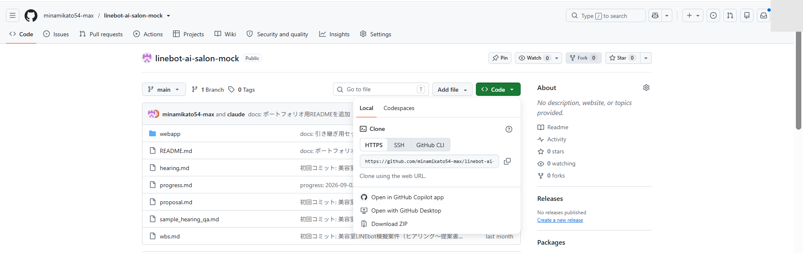
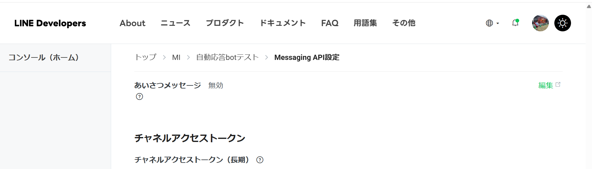
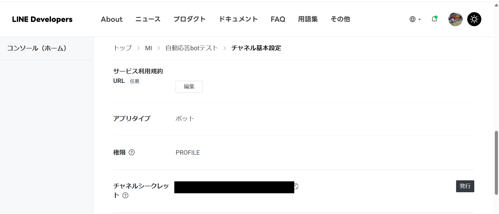
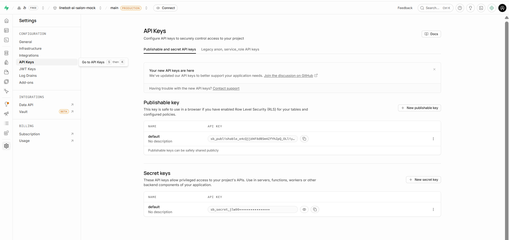
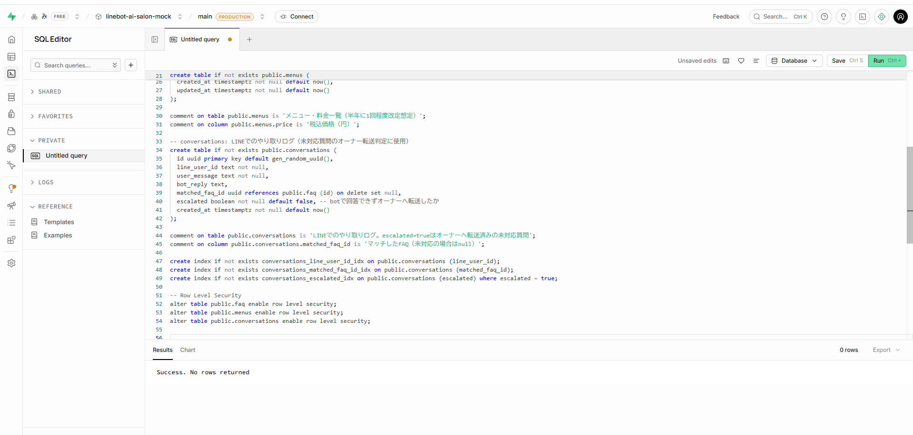
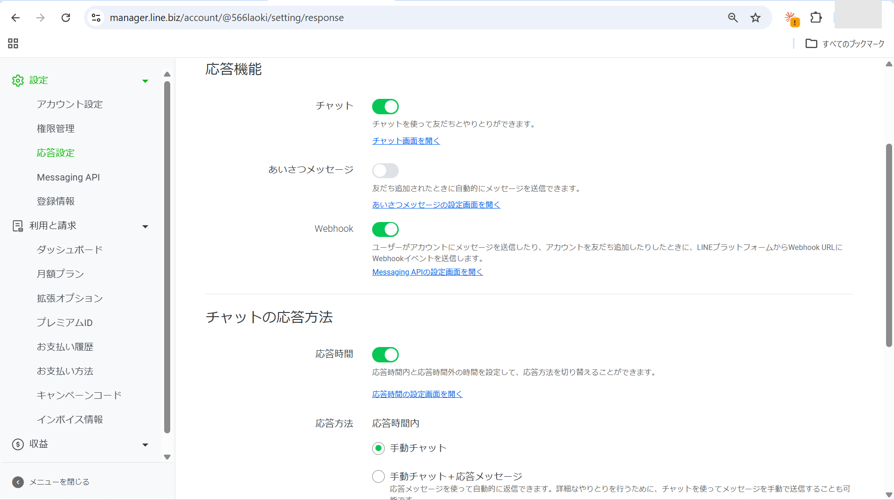
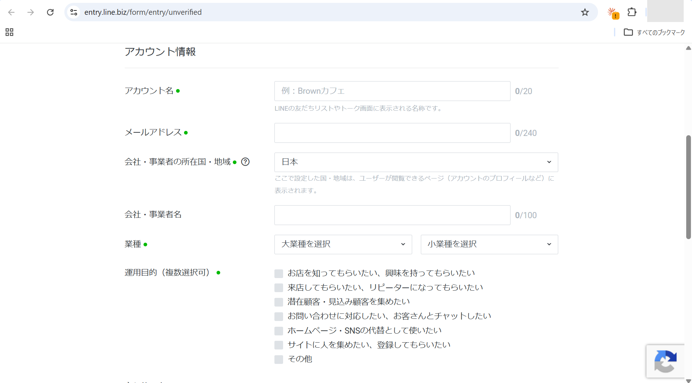
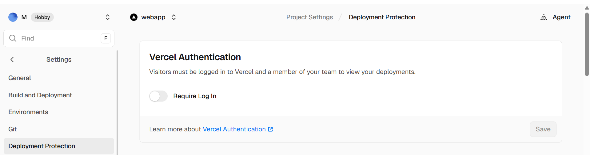
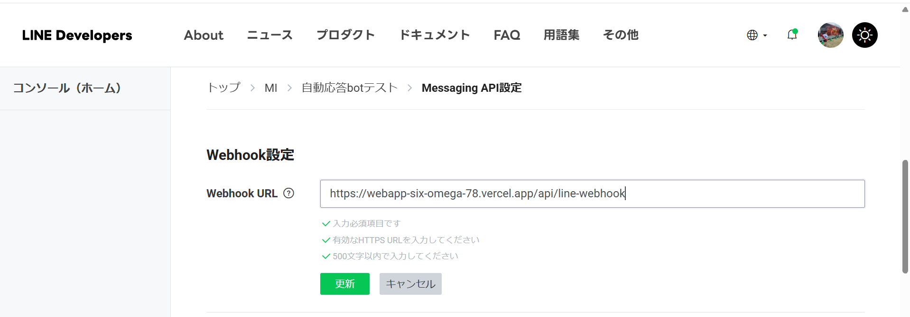
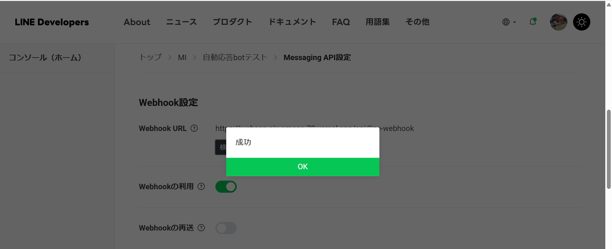

# セットアップ手順書（開発環境構築マニュアル）

対象読者: このプロジェクトを今後引き継いで開発・保守する人（Web開発の基礎知識がある人向け）

このドキュメントは、今このシステムを開発しているPCとは**別のPC**で、ゼロから開発できる状態を作るための手順です。上から順番に進めてください。

---

## 1. このシステムの全体像

美容室オーナー様向けのLINE自動応答bot（お客様のFAQ・メニュー質問に自動で答える）と、それを管理するための管理画面（スマホから使う）のセットです。

- Webサイト部分（bot本体＋管理画面）: **Next.js**というフレームワークで作られたプログラム
- データの保存先: **Supabase**というサービス（お店の外部にあるデータベース）
- メッセージの送受信: **LINE Messaging API**というLINE公式の仕組み
- 公開先（本番環境）: **Vercel**というホスティングサービス

図で表すと以下のような構成です（詳しい繋がりは「技術ドキュメント」を参照）。

```
お客様のLINE ⇄ LINE公式アカウント ⇄ Vercel上のプログラム ⇄ Supabase（データ保存）
                                              ↕
                                    オーナー様の管理画面（スマホ）
```

---

## 2. 事前に必要なもの（アカウント）

作業を始める前に、以下のアカウントが必要です。すでにあるものは新規作成不要です。

| サービス        | 用途                         | URL                                  |
| --------------- | ---------------------------- | ------------------------------------ |
| GitHub          | プログラムのソースコード保管 | https://github.com                   |
| Supabase        | データベース                 | https://supabase.com                 |
| LINE Developers | LINE公式アカウントの管理     | https://developers.line.biz/console/ |
| Vercel          | Webサイトの公開（本番環境）  | https://vercel.com                   |
| OpenAI          | AIによる自動回答生成         | https://platform.openai.com          |

---

## 3. パソコンに入れておくもの

以下を一度だけインストールします。

1. **Node.js**（バージョン20以上）: https://nodejs.org からダウンロードしてインストール
2. **git**: https://git-scm.com からダウンロードしてインストール
3. **Vercelコマンドラインツール**（後述のデプロイで使用）
   ```bash
   npm install -g vercel
   ```

インストールできたか確認するコマンド（黒い画面＝ターミナル/コマンドプロンプトで実行）:

```bash
node -v
git --version
vercel --version
```

それぞれバージョン番号が表示されればOKです。

---

## 4. ソースコードを手元に取得する

```bash
git clone <このプロジェクトのGitHubリポジトリURL>
cd <取得したフォルダ名>/webapp
```



---

## 5. 必要なプログラム部品をインストールする

```bash
npm install
```

数分待つと完了します（`node_modules`という大量のファイルが入ったフォルダが作られます）。

---

## 6. 環境変数（秘密の設定情報）を用意する

`webapp`フォルダの直下に `.env.local` という名前のファイルを新規作成し、以下の項目を埋めます。**このファイルは絶対にGitHubにアップロードしないでください**（`.gitignore`で除外済みですが、念のため）。

```
LINE_CHANNEL_SECRET=
LINE_CHANNEL_ACCESS_TOKEN=
NEXT_PUBLIC_SUPABASE_URL=
NEXT_PUBLIC_SUPABASE_ANON_KEY=
SUPABASE_SERVICE_ROLE_KEY=
OPENAI_API_KEY=
OPENAI_MODEL=gpt-4o-mini
OWNER_LINE_USER_ID=
ADMIN_PASSWORD=
```

各項目の取得場所は以下の通りです。

| 変数名                          | 何のための値か                                                             | どこで取得するか                                                                                            |
| ------------------------------- | -------------------------------------------------------------------------- | ----------------------------------------------------------------------------------------------------------- |
| `LINE_CHANNEL_SECRET`           | LINEとの通信を検証するための鍵                                             | LINE Developers Console → 対象チャネル → 「チャネル基本設定」タブ                                           |
| `LINE_CHANNEL_ACCESS_TOKEN`     | LINEにメッセージを送るための鍵                                             | LINE Developers Console → 対象チャネル → 「Messaging API設定」タブ → チャネルアクセストークン（長期）を発行 |
| `NEXT_PUBLIC_SUPABASE_URL`      | データベースの接続先URL                                                    | Supabaseダッシュボード → 対象プロジェクト → Project Settings → API                                          |
| `NEXT_PUBLIC_SUPABASE_ANON_KEY` | データベースへの一般アクセス用の鍵                                         | 同上（API画面内）                                                                                           |
| `SUPABASE_SERVICE_ROLE_KEY`     | データベースへの管理者アクセス用の鍵（**取り扱い注意・絶対に公開しない**） | 同上（API画面内）                                                                                           |
| `OPENAI_API_KEY`                | AI回答生成のための鍵                                                       | OpenAIダッシュボード → API keys                                                                             |
| `OPENAI_MODEL`                  | 使用するAIモデル名                                                         | `gpt-4o-mini`のままでOK（コストを抑えたモデル）                                                             |
| `OWNER_LINE_USER_ID`            | 未対応質問の通知を送る先（オーナー様個人のLINE ID）                        | 「運用マニュアル」を参照                                                                                    |
| `ADMIN_PASSWORD`                | 管理画面ログイン用のパスワード                                             | 任意の文字列を決めて設定（オーナー様に伝える）                                                              |





_（チャネルシークレットの実際の値は黒塗りしています。この値は絶対に公開しないでください）_



---

## 7. データベース（Supabase）の準備

初めてこのプロジェクトのSupabaseプロジェクトを作る場合のみ必要です（既存のSupabaseプロジェクトを引き継ぐ場合はスキップ）。

1. Supabaseで新規プロジェクトを作成
2. `webapp/supabase/migrations/` フォルダの中にあるSQLファイルの内容を、Supabaseダッシュボードの「SQL Editor」で実行する（`faq`・`menus`・`conversations`の3つの表が作られます）



---

## 8. LINE公式アカウントの設定

1. LINE Developers Consoleにログインし、プロバイダーを作成（既存があれば流用）
2. 新規チャネル作成 →「Messaging API」を選択
3. 手順6で設定した `LINE_CHANNEL_SECRET` と `LINE_CHANNEL_ACCESS_TOKEN` を取得・設定
4. 「応答メッセージ」設定で、LINE公式アカウントの自動あいさつ等をオフにする（botの応答と重複するため）





---

## 9. 手元のパソコンで動作確認する

```bash
npm run dev
```

`http://localhost:3000` が起動します。この時点ではLINEからのメッセージはまだ届きません（後述のVercel公開後、Webhook URLを設定して初めて届くようになります）。

管理画面は `http://localhost:3000/admin` で確認できます（パスワードは手順6で設定した `ADMIN_PASSWORD`）。

---

## 10. Vercelに公開する（本番環境の構築）

すでに本番環境がある場合（このプロジェクトを既存のVercelプロジェクトとして引き継ぐ場合）は、下記の1〜2だけ行えばOKです。新しく作り直す場合は3以降も行います。

1. Vercelにログイン
   ```bash
   vercel login
   ```
2. プロジェクトフォルダで連携
   ```bash
   vercel link
   ```
3. （新規構築の場合のみ）環境変数を設定
   ```bash
   vercel env add LINE_CHANNEL_SECRET production
   vercel env add LINE_CHANNEL_SECRET preview
   ```
   のように、手順6の変数すべてを `production` と `preview` の両方に登録する
4. 本番公開
   ```bash
   vercel deploy --prod
   ```

> ⚠️ **重要**: Vercelの新規プロジェクトには「Deployment Protection（アクセス制限）」がデフォルトでオンになっており、これがオンのままだとLINEからの通知が届きません。Vercelダッシュボード →対象プロジェクト → Settings → Deployment Protection →「Require Log In」をオフにしてください。



---

## 11. LINE Webhook URLを本番URLに設定する

1. LINE Developers Console → 対象チャネル →「Messaging API設定」タブ
2. Webhook URLに `https://<Vercelの本番URL>/api/line-webhook` を入力
3. 「検証」ボタンを押して成功することを確認
4. 「Webhookの利用」をオンにする





---

## 12. うまくいかない時（トラブルシューティング）

| 症状                                          | 考えられる原因                                               | 対処                                       |
| --------------------------------------------- | ------------------------------------------------------------ | ------------------------------------------ |
| LINEにメッセージを送っても返事が来ない        | Webhook URLが古い／Webhookの利用がオフ                       | 手順11を再確認                             |
| 管理画面にログインできない                    | `ADMIN_PASSWORD`の入力ミス、またはVercel側の環境変数が未設定 | Vercelの環境変数設定を確認                 |
| 本番デプロイがエラーで失敗する                | 環境変数の設定漏れ                                           | `vercel env ls` で設定済みの変数一覧を確認 |
| 外部からアクセスすると403やログイン画面が出る | Deployment Protectionがオン                                  | 手順10の注意事項を再確認                   |

---

## 13. プロジェクトの構成（参考）

```
webapp/
├─ src/
│  ├─ app/
│  │  ├─ api/line-webhook/route.ts   … LINEからのメッセージを受け取る窓口
│  │  ├─ admin/                      … 管理画面（ログイン・FAQ・メニュー・会話ログ・お知らせ配信）
│  │  └─ page.tsx                    … トップページ
│  ├─ components/                    … 画面部品（ボタン等）
│  └─ lib/                           … データベース接続・AI回答生成などの共通処理
├─ supabase/migrations/              … データベースの表を作るSQL
└─ docs/                             … このドキュメント一式
```

詳しい仕様は「技術ドキュメント」を参照してください。
