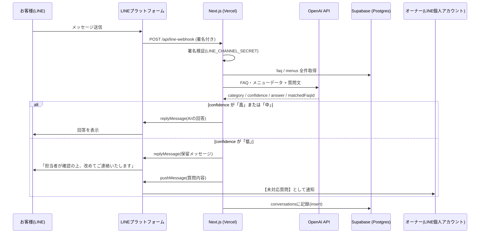

# 技術ドキュメント

開発を引き継ぐエンジニア向けの技術仕様書です。全体像は[セットアップ手順書](./setup-guide.md)、日々の使い方は[運用マニュアル](./owner-manual.md)を参照してください。

---

## 1. システム構成・外部サービス連携図



管理画面（オーナー操作）は、Vercel上のNext.js Server Actionsから直接Supabase（`SUPABASE_SERVICE_ROLE_KEY`使用）とLINE Messaging API（お知らせ配信時のみ）に接続する構成です。管理画面専用の別バックエンドは存在しません。

```
[オーナーのスマホ] --HTTPS--> [Vercel: Next.js /admin] --service_role--> [Supabase]
                                                        --broadcast API--> [LINEプラットフォーム] --> [LINE友だち全員]
```

---

## 2. API仕様

### 2-1. `POST /api/line-webhook`

LINEプラットフォームからのWebhookを受け取る唯一の公開APIエンドポイント。実装: `src/app/api/line-webhook/route.ts`

| 項目             | 内容                                                                                                                            |
| ---------------- | ------------------------------------------------------------------------------------------------------------------------------- |
| 認証             | LINEが送信するリクエストヘッダー `x-line-signature` を `@line/bot-sdk` の `validateSignature()` で検証。不正な場合は`401`を返す |
| ランタイム       | `nodejs`（`crypto`を使う署名検証のため、Edge Runtimeではなく明示的にNode.jsランタイムを指定）                                   |
| リクエストボディ | LINEプラットフォーム標準の`webhook.CallbackRequest`形式（`events`配列）                                                         |
| 処理対象イベント | `message`タイプかつ`text`メッセージのみ処理。それ以外（スタンプ・画像等）は無視                                                 |
| レスポンス       | 常に`{ status: "ok" }`（200）。LINE側の再送を防ぐため、内部処理の成否に関わらずWebhook自体は正常応答する設計                    |

処理の流れ（`handleEvent`関数）:

1. `getAllFaq()` / `getAllMenus()` でSupabaseから全FAQ・全メニューを取得
2. `generateAnswer()`（後述）でOpenAIに回答生成を依頼
3. `confidence === "低"` なら`escalated = true`とし、お客様には定型の保留メッセージ、オーナーには`pushMessage`で質問内容を通知（`OWNER_LINE_USER_ID`宛）
4. お客様への返信は`replyMessage`（Webhookのreply tokenを使用。無料・reply専用）
5. オーナーへの通知は`pushMessage`（reply tokenを使わない、任意タイミングでの送信用API）
6. `conversations`テーブルにやり取りを記録

### 2-2. 管理画面側（Server Actions）

管理画面はNext.jsの**Server Actions**（`"use server"`関数をフォームの`action`に直接渡す方式）で実装されており、独立したREST/JSON APIエンドポイントは存在しません。一覧化すると以下の通りです。

| 機能                   | ファイル                                         | 概要                                                     |
| ---------------------- | ------------------------------------------------ | -------------------------------------------------------- |
| ログイン               | `src/app/admin/login/actions.ts`                 | パスワード照合 → Cookieにセッション値をセット            |
| ログアウト             | `src/app/admin/logout-action.ts`                 | セッションCookieを削除                                   |
| FAQ作成/更新/削除      | `src/app/admin/(dashboard)/faq/actions.ts`       | `src/lib/faq.ts`のCRUD関数を呼び出し                     |
| メニュー作成/更新/削除 | `src/app/admin/(dashboard)/menus/actions.ts`     | 同上                                                     |
| お知らせ一斉配信       | `src/app/admin/(dashboard)/broadcast/actions.ts` | `lineClient.broadcast()`を呼び出し、LINE友だち全員に送信 |

### 2-3. AI回答生成ロジック（`src/lib/answerGenerator.ts`）

OpenAI Chat Completions API（`response_format: { type: "json_object" }`）を使い、構造化されたJSONを直接生成させている。モデルは環境変数`OPENAI_MODEL`で切り替え可能（デフォルト`gpt-4o-mini`）。

出力スキーマ（Zodで検証）:

```ts
{
  category: "faq" | "menu" | "other",
  confidence: "高" | "中" | "低",
  answer: string,       // お客様への回答文
  matchedFaqId: string | null, // 根拠にしたFAQのUUID
}
```

システムプロンプトで「渡されたFAQ/メニューデータに直接書かれている内容のみを根拠にすること（ハルシネーション禁止）」を明示しており、データにない情報は`confidence: "低"`として扱われるよう設計している。

---

## 3. データベース設計（Supabase / PostgreSQL）

マイグレーションファイル: `webapp/supabase/migrations/20260826000000_create_faq_menus_conversations.sql`

### `faq`

| カラム                      | 型          | 説明                                            |
| --------------------------- | ----------- | ----------------------------------------------- |
| `id`                        | uuid (PK)   | `gen_random_uuid()`                             |
| `question`                  | text        | 質問文                                          |
| `answer`                    | text        | 回答文                                          |
| `keywords`                  | text[]      | キーワードマッチ用の配列（GINインデックス付き） |
| `created_at` / `updated_at` | timestamptz |                                                 |

### `menus`

| カラム                      | 型               | 説明           |
| --------------------------- | ---------------- | -------------- |
| `id`                        | uuid (PK)        |                |
| `name`                      | text             | メニュー名     |
| `price`                     | integer          | 税込価格（円） |
| `description`               | text（nullable） |                |
| `created_at` / `updated_at` | timestamptz      |                |

### `conversations`

| カラム           | 型                                              | 説明                                      |
| ---------------- | ----------------------------------------------- | ----------------------------------------- |
| `id`             | uuid (PK)                                       |                                           |
| `line_user_id`   | text                                            | メッセージ送信者のLINE user ID            |
| `user_message`   | text                                            | お客様の質問文                            |
| `bot_reply`      | text（nullable）                                | botが実際に返信した文面                   |
| `matched_faq_id` | uuid（FK→faq.id, nullable, on delete set null） | AIが根拠にしたFAQ                         |
| `escalated`      | boolean                                         | `true`=confidenceが低くオーナーへ転送済み |
| `created_at`     | timestamptz                                     |                                           |

インデックス: `line_user_id`、`matched_faq_id`、`escalated`（`where escalated = true`の部分インデックス、会話ログの「要対応」抽出を高速化）

### Row Level Security（RLS）

| テーブル        | anon/authenticated                         | service_role |
| --------------- | ------------------------------------------ | ------------ |
| `faq`           | SELECT可（公開読み取り）                   | 全権限       |
| `menus`         | SELECT可（公開読み取り）                   | 全権限       |
| `conversations` | **権限なし**（顧客とのやり取りログのため） | 全権限       |

管理画面・Webhookはいずれもサーバー側（Next.jsのサーバーコンポーネント/Server Actions/APIルート）から`SUPABASE_SERVICE_ROLE_KEY`を使う`supabaseAdmin`クライアント（`src/lib/supabase.ts`）経由でのみDBにアクセスしており、ブラウザから直接Supabaseを叩く処理は存在しない。

---

## 4. 認証・認可の仕組み

管理画面は、複数ユーザー管理を持たない**共通パスワード方式**（`src/lib/auth.ts`）。

1. `ADMIN_PASSWORD`（環境変数）とログインフォームの入力値を単純比較
2. 一致すればセッションCookie（`admin_session`）に、`sha256(ADMIN_PASSWORD)`のハッシュ値をセット（有効期限なし＝ブラウザ側の設定に依存）
3. `src/proxy.ts`（Next.js 16での`middleware`に相当する仕組み。`matcher: ["/admin/:path*"]`）が、`/admin/login`以外の全リクエストでCookieを検証し、不正なら`/admin/login`へリダイレクト

> 本番運用上の注意: これは「合言葉」方式であり、ユーザーごとのアカウント管理・権限分離はできません。複数人で管理画面を使う場合や、より高いセキュリティが必要な場合は、Supabase Authなどへの置き換えを検討してください。

---

## 5. 環境変数一覧

| 変数名                          | 用途                                  | 公開範囲                      |
| ------------------------------- | ------------------------------------- | ----------------------------- |
| `LINE_CHANNEL_SECRET`           | Webhook署名検証                       | サーバー専用                  |
| `LINE_CHANNEL_ACCESS_TOKEN`     | LINEへのメッセージ送信                | サーバー専用                  |
| `NEXT_PUBLIC_SUPABASE_URL`      | Supabase接続先                        | クライアント公開可            |
| `NEXT_PUBLIC_SUPABASE_ANON_KEY` | Supabase一般アクセス                  | クライアント公開可（RLS前提） |
| `SUPABASE_SERVICE_ROLE_KEY`     | Supabase管理者アクセス（RLSバイパス） | **サーバー専用・厳重管理**    |
| `OPENAI_API_KEY`                | AI回答生成                            | サーバー専用                  |
| `OPENAI_MODEL`                  | 使用モデル名（既定: `gpt-4o-mini`）   | サーバー専用                  |
| `OWNER_LINE_USER_ID`            | 未対応質問の通知先                    | サーバー専用                  |
| `ADMIN_PASSWORD`                | 管理画面ログイン                      | サーバー専用                  |

---

## 6. デプロイ構成（Vercel）

- Vercelプロジェクト: `mim2543/webapp`
- 本番URL: `https://webapp-six-omega-78.vercel.app`
- `src/app/admin/(dashboard)/layout.tsx` に `export const dynamic = "force-dynamic";` を指定
  - 理由: Next.jsはデフォルトで可能な限りページを**ビルド時に静的生成**しようとするが、管理画面配下は認証必須かつ常に最新のDB内容を表示する必要があるため、静的生成の対象から明示的に除外している。これを外すとビルド時にSupabase接続を試みて失敗する（JWTの発行時刻に関するエラー）
- Vercelの Deployment Protection（Vercel Authentication / SSOによるアクセス制限）は**無効化済み**。これが有効だとLINEのWebhookからのリクエストも管理画面への外部アクセスもブロックされるため

---

## 7. ディレクトリ構成（主要部分）

```
webapp/src/
├─ app/
│  ├─ api/line-webhook/route.ts   … Webhook受信エンドポイント
│  ├─ admin/
│  │  ├─ login/                   … ログイン画面・ログイン処理
│  │  ├─ logout-action.ts
│  │  └─ (dashboard)/             … ログイン必須の管理画面本体
│  │     ├─ layout.tsx            … force-dynamic指定・共通レイアウト
│  │     ├─ page.tsx              … ホーム（4メニューへの入り口）
│  │     ├─ faq/                  … FAQ一覧・新規作成・編集・削除
│  │     ├─ menus/                … メニュー一覧・新規作成・編集・削除
│  │     ├─ conversations/        … 会話ログ閲覧
│  │     └─ broadcast/            … お知らせ一斉配信
│  └─ page.tsx                    … トップページ（未使用に近い簡易ページ）
├─ components/                    … Button / DeleteButton / BackToHomeButton等
├─ lib/
│  ├─ supabase.ts                 … Supabaseクライアント（anon用・service_role用）
│  ├─ auth.ts                     … 管理画面パスワード認証
│  ├─ faq.ts                      … faq/menusのCRUD
│  ├─ conversations.ts            … 会話ログ取得
│  ├─ line.ts                     … LINE Messaging APIクライアント
│  ├─ openai.ts                   … OpenAIクライアント
│  └─ answerGenerator.ts          … AI回答生成ロジック
└─ proxy.ts                       … 管理画面の認証ガード（Next.js 16のmiddleware）
```

---

## 8. 既知の制約・今後の改善候補

- 管理画面の認証は共通パスワード方式のみ。ユーザー別のアクセス制御が必要になった場合はSupabase Authへの移行を検討
- `conversations`は直近50件をアプリ側で取得する実装（ページネーション未実装）。データ量が増えた場合は要対応
- FAQのマッチングは全件をOpenAIに渡す方式のため、FAQ件数が非常に多くなった場合はコスト・レイテンシの観点でベクトル検索等への切り替えを検討
